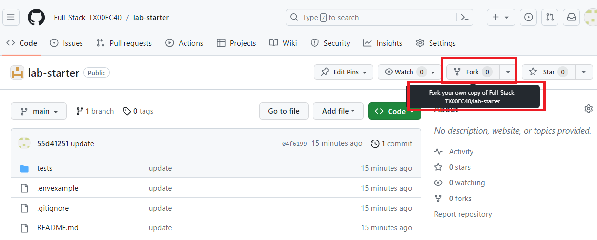
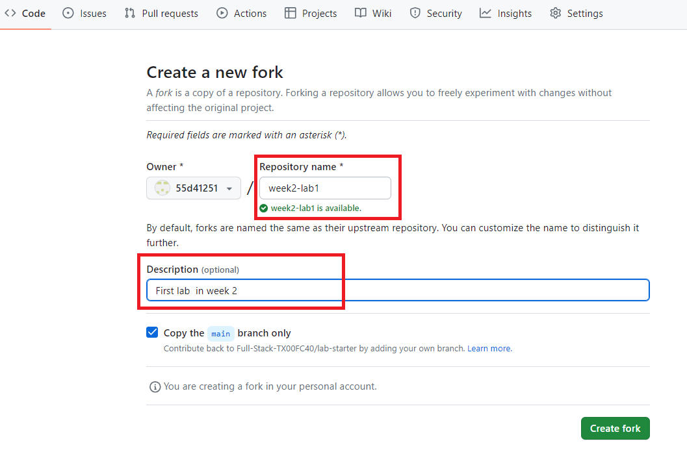

# Lab Starter Code Repository

Welcome to the Lab Starter Code Repository! This repository serves as the starting point for various labs and exercises.

### Preparation

1. Go to your "`Documents`" folder and create a new folder called `dev`. This folder will be used to store all of your lab activities for the fullStack course

2. Inside the `dev` folder, create another folder named `week2`.

3. Within the `week2` folder, clone the repository to your local machine. 

> You will follow a similar process for each week's activities. For example, in week 3, create a new folder inside the "dev" folder named "`week3`" and clone the repository for that week's activities.

These steps will help you organize your lab activities in separate folders within the "`dev`" directory for each week's work.

### Requirements

To get started, please follow these steps:

1. **Fork this Repository**: 

- Click the "Fork" button in the top right corner of this repository to create a copy in your own GitHub account.



- Make sure to **customize** the **fork name** at the same time you're creating it e.g. `Week2-lab1`



2. **Clone repo to Your Local Machine**: Clone your forked repository to your local machine using the following command. 
  - Replace `<your-username>` with your GitHub username
  - Replace `<new-repo>` with the name of the task e.g. `week2-task1`

```shell
git clone https://github.com/<your-username>/<new-repo>.git
```

3. **Verify Your Username**: Confirm that your forked repository is set as the remote origin. Run the following command to check:

```shell
git remote -v
```

You should see your forked repository URL as the origin.

### Submission

Upon completing a lab exercise, follow these steps to submit your work:

1. **Stage Your Changes**: Add all the changes you've made to the staging area using the following command:

```shell
git add .
```

2. **Commit Your Changes**: Commit your changes with a descriptive message. Replace `#` with the lab number and week number you're working on:

```shell
git commit -m "Solved lab # week #"
```

3. **Push Your Changes**: Push your committed changes to your forked repository on GitHub:

```shell
git push origin main
```

Note: If you're working on a branch other than `main`, replace `main` with the name of your branch.

Happy coding!
